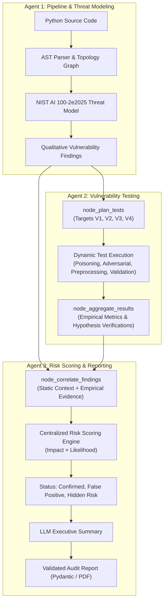

# AegisML - Multi-Agent ML Security Auditor

AegisML is an agentic security audit system designed to analyze machine learning pipelines, evaluate ML-specific attack surfaces, perform empirical adversarial testing, and generate evidence-informed security reports.

The system is organized into three specialized collaborative agents:
- **Agent 1: Pipeline & Threat Modeling Agent**: Performs static AST analysis of Python ML code, extracts pipeline topology graphs using NetworkX, derives deployment context and threat models following the **NIST AI 100-2e2025** adversarial ML taxonomy, and identifies MVP vulnerability classes with qualitative remediation recommendations.
- **Agent 2: Vulnerability Testing Agent**: Executes dynamic security tests (data poisoning simulations, input preprocessing stress tests, data corruption validation, and IBM ART HopSkipJump adversarial evasion attacks) to produce empirical measurements.
- **Agent 3: Risk Scoring & Reporting Agent**: Serves as the centralized mathematical scoring authority. It correlates Agent 1's static baseline with Agent 2's empirical testing evidence to compute final evidence-informed risk scores, identify correlation discrepancies (Confirmed Risks, False Positives, Hidden Risks), synthesize executive summaries, and generate audit reports.

---

## Core Vulnerability Classes (MVP)

AegisML evaluates ML pipelines across four primary vulnerability categories:

1. **Data Poisoning (V1)**: Ingestion of unverified training data without cryptographic provenance or outlier filtering. Evaluated empirically via label-flipping degradation benchmarks and SVM decision-boundary poisoning.
2. **Preprocessing Attack Surface (V2)**: Unsanitized input cleaning, regex vulnerabilities, and unconstrained tokenization. Evaluated empirically via malformed, long, and edge-case string fuzzing.
3. **Data Validation Weaknesses (V3)**: Missing schema, type, range, or null checks before training. Evaluated empirically by injecting duplicate rows and missing values into training data and measuring model degradation.
4. **Adversarial Robustness (V4)**: Susceptibility to evasion attacks at inference time. Evaluated empirically using IBM ART's `HopSkipJump` decision-boundary black-box attack under a strict relative $L_2$ perturbation budget ($\le 0.5$).

---

## System Architecture



---

## Project Structure

```text
AegisML/
├── api.py                            # FastAPI REST service exposing /audit and health checks
├── app.py                            # Streamlit interactive dashboard UI with PDF generation
├── main.py                           # CLI entry point running Agent 1 -> Agent 2 -> Agent 3 end-to-end
├── generate_model_and_dataset.py     # Utility: generates sample trained model & evaluation dataset
├── requirements.txt                  # Python project dependencies
├── data/                             # Evaluation artifacts and target pipelines
│   ├── 21011088.py                   # Sample target pipeline to audit
│   ├── model.pkl                     # Serialized model artifact
│   └── dataset.csv                   # Target evaluation dataset
├── ui/                               # Streamlit UI dashboard rendering modules and CSS
│   ├── dashboard.py                  # Component renderers for pipeline topology & findings
│   └── styles.css                    # Custom dashboard styling
└── src/
    └── agents/
        ├── pipeline_agent/           # Agent 1
        │   ├── code_parser.py        # AST pipeline structural extraction
        │   ├── networkx_utils.py     # NetworkX topology analysis
        │   ├── schemas.py            # Pydantic v2 schemas for NIST threat modeling
        │   ├── steps.py              # Prompt chains & indirect injection sanitization
        │   ├── graph.py              # LangGraph StateGraph & self-repair loop
        │   └── pipeline_agent.py     # Execution entry point
        ├── testing_agent/            # Agent 2
        │   ├── loader.py             # Model, vectorizer, and dataset artifact loaders
        │   ├── poisoning_test.py     # V1 empirical poisoning & label-flipping tests
        │   ├── preprocess_test.py    # V2 preprocessing edge-case & crash tests
        │   ├── validation_test.py    # V3 data corruption retraining degradation tests
        │   ├── adversarial_test.py   # V4 IBM ART HopSkipJump evasion attack
        │   ├── graph.py              # LangGraph StateGraph, routing & hypothesis verification
        │   └── testing_agent.py      # Execution entry point
        └── reporting_agent/          # Agent 3
            ├── schemas.py            # Pydantic v2 schemas for audit reports and findings
            ├── risk_scoring.py       # Centralized quantitative risk calculation engine
            ├── report_builder.py     # Executive summary LLM generation & ReportLab PDF builder
            ├── graph.py              # LangGraph correlation and reporting workflow
            └── reporting_agent.py    # Execution entry point
```

---

## Installation & Setup

### 1. Clone the Repository
```bash
git clone https://github.com/AlsaeedR/AegisML.git
cd AegisML
```

### 2. Create and Activate Virtual Environment

**Windows (PowerShell)**:
```powershell
python -m venv .venv
.\.venv\Scripts\Activate.ps1
```

**macOS / Linux**:
```bash
python3 -m venv .venv
source .venv/bin/activate
```

### 3. Install Dependencies
```bash
pip install -r requirements.txt
```

### 4. Configure Environment Variables
Copy `.env.example` to create your local `.env` file:

**Windows (PowerShell)**:
```powershell
Copy-Item .env.example .env
```

**macOS / Linux**:
```bash
cp .env.example .env
```

Set your OpenAI API key in `.env`:
```env
OPENAI_API_KEY=your_openai_api_key_here
OPENAI_MODEL_NAME=gpt-4o-mini
```

### 5. Generate Evaluation Fixtures (One-Time Setup)
If `data/model.pkl` or `data/dataset.csv` are missing, regenerate the baseline test fixtures:
```bash
python generate_model_and_dataset.py
```

---

## Execution Modes

AegisML can be executed in three ways: via CLI, as a headless FastAPI REST service, or as an interactive Streamlit web dashboard.

### Mode 1: Command-Line Interface (CLI)

Run the full multi-agent pipeline (Agent 1 $\rightarrow$ Agent 2 $\rightarrow$ Agent 3) directly from the terminal:

```bash
python main.py
```

**Execution Pipeline:**
1. **Agent 1**: Audits the pipeline code in `data/21011088.py`, builds the topology graph, establishes the NIST threat model, and detects vulnerabilities.
2. **Agent 2**: Evaluates `data/model.pkl` and `data/dataset.csv` against V1–V4, measuring accuracy degradation and attack success rates.
3. **Agent 3**: Correlates static context with dynamic metrics, computes baseline and final risk scores, synthesizes an LLM executive summary, and outputs the validated JSON report to stdout.

---

### Mode 2: FastAPI Backend Service

Run the REST API backend using `uvicorn`:

```bash
uvicorn api:app --reload --port 8000
```

* **Health Check**: `GET http://127.0.0.1:8000/` (returns `{"message": "AegisML API is running."}`)
* **Interactive Swagger UI**: Navigate to `http://127.0.0.1:8000/docs` in your browser.
* **Audit Endpoint (`POST /audit`)**: Accepts `multipart/form-data`:
  * `pipeline_file`: Python script (`.py`)
  * `model_file`: Serialized model (`.pkl`)
  * `dataset_file`: Evaluation dataset (`.csv`)
  * `text_column`: Column name for text features (default: `text`)
  * `label_column`: Column name for target labels (default: `label`)

Example cURL request:
```bash
curl -X POST "http://127.0.0.1:8000/audit" \
  -F "pipeline_file=@data/21011088.py" \
  -F "model_file=@data/model.pkl" \
  -F "dataset_file=@data/dataset.csv" \
  -F "text_column=text" \
  -F "label_column=label"
```

---

### Mode 3: Streamlit Web Dashboard

The web dashboard provides an interactive graphical interface for uploading pipeline assets, inspecting graphs, viewing correlation analyses, and downloading executive PDF reports.

#### Running Full Stack (API + Dashboard):

**Terminal 1 (Backend API):**
```bash
uvicorn api:app --reload --port 8000
```

**Terminal 2 (Streamlit UI):**
```bash
streamlit run app.py
```

The application will open in your browser at `http://localhost:8501`.

#### Dashboard Features:
* **Asset Upload Screen**: Upload pipeline `.py`, model `.pkl`, and dataset `.csv`.
* **Overview Tab**: Displays overall risk score (out of 10), severity badge, confirmed findings count, and LLM executive summary.
* **Pipeline & Findings Tab**: Visualizes pipeline nodes, affected components, dynamic test metrics, and detailed remediation advice.
* **Governance Mapping Tab**: Maps empirical findings to NIST AI Risk Management framework controls and highlights False Positives vs. Hidden Risks.
* **Full Report Tab**: Generates and downloads a comprehensive, multi-page security audit PDF document built with ReportLab.

---

## Risk Scoring Methodology

AegisML centralizes all risk quantification in **Agent 3**:

$$\text{Theoretical Risk} = \frac{\text{Base Impact} \times \text{Static Likelihood}}{10}$$

$$\text{Final Evidence-Informed Risk} = \frac{\text{Base Impact} \times \text{Evidence-Adjusted Likelihood}}{10}$$

* **Confirmed Risk**: Agent 1 detected the threat and Agent 2 empirically confirmed vulnerability.
* **False Positive**: Agent 1 flagged High/Critical static risk, but Agent 2 proved the model was resilient (`not_vulnerable`). Likelihood is scaled down to residual baseline ($2.0/10$).
* **Hidden Risk**: Agent 1 rated static risk Low, but Agent 2 successfully attacked the model (`vulnerable`). Likelihood is scaled up.
