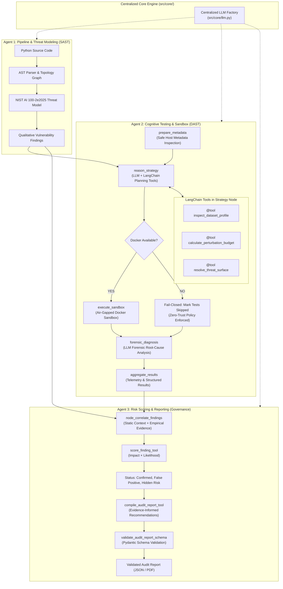
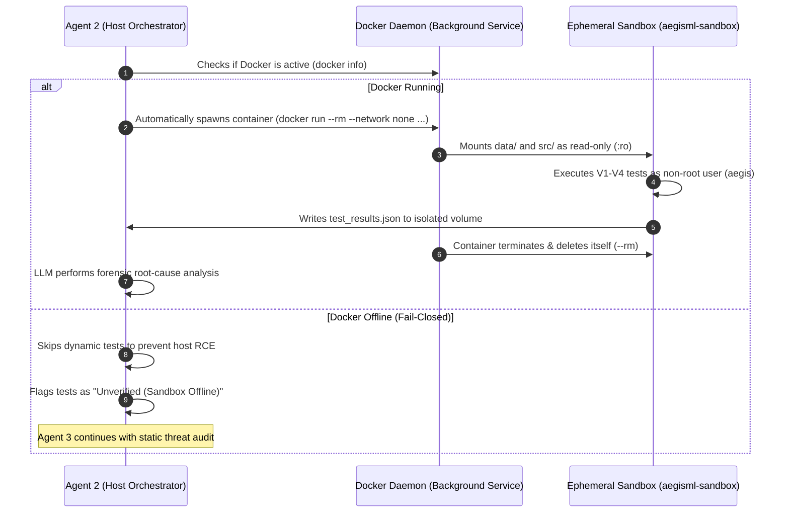

# AegisML - Multi-Agent ML Security Auditor

AegisML is an agentic security audit system designed to analyze machine learning pipelines, evaluate ML-specific attack surfaces, perform cognitive empirical adversarial testing inside isolated sandboxes, and generate evidence-informed security reports.

The system is organized into three specialized collaborative agents:
- **Agent 1: Pipeline & Threat Modeling Agent (SAST)**: Performs static AST analysis of Python ML code, extracts pipeline topology graphs using NetworkX, derives deployment context and threat models following the **NIST AI 100-2e2025** adversarial ML taxonomy, and identifies theoretical vulnerability classes.
- **Agent 2: Vulnerability Testing Agent (DAST)**: Operates as a cognitive penetration testing engine using the **Bounded Agency Pattern**. It leverages LangChain tools within LangGraph nodes to formulate an attack strategy, dispatches tests into an air-gapped **Zero-Trust Docker Sandbox**, and conducts post-attack forensic root-cause analysis.
- **Agent 3: Risk Scoring & Reporting Agent (Governance)**: Serves as the centralized mathematical scoring authority. It correlates Agent 1's static baseline with Agent 2's empirical testing evidence, computes NIST AI 100-2 risk scores, synthesizes evidence-informed remediation recommendations, generates executive summaries, and formats comprehensive audit reports.

---

## Core Vulnerability Classes (MVP)

AegisML evaluates ML pipelines across four primary vulnerability categories:

1. **Data Poisoning (V1)**: Ingestion of unverified training data without cryptographic provenance or outlier filtering. Evaluated empirically via label-flipping degradation benchmarks and decision-boundary poisoning.
2. **Preprocessing Attack Surface (V2)**: Unsanitized input cleaning, regex vulnerabilities, and unconstrained tokenization. Evaluated empirically via malformed, long, and edge-case string fuzzing.
3. **Data Validation Weaknesses (V3)**: Missing schema, type, range, or null checks before training. Evaluated empirically by injecting duplicate records and missing values into training data and measuring accuracy degradation.
4. **Adversarial Robustness (V4)**: Susceptibility to evasion attacks at inference time. Evaluated empirically using IBM ART's `HopSkipJump` decision-boundary black-box attack under a strict relative $L_2$ perturbation budget ($\le 0.35 - 0.50$).

---

## System Architecture



---

## Zero-Trust Sandbox Isolation & Docker Execution

AegisML enforces a strict **Zero-Trust policy** for all dynamic penetration testing. Target pipeline scripts (`pipeline.py`) and serialized models (`model.pkl`) are treated as untrusted, hostile artifacts and are **never detonated in-process on the host system**.

### How Docker Runs (Automated & Ephemeral)

> [!IMPORTANT]
> **No Manual Container Management Required**:
> You do **not** need to keep a separate terminal open running Docker, and you do **not** need to run a manual `docker run` command during testing!
> 
> As long as **Docker Desktop** (or the Docker daemon) is running in the background on your system, AegisML handles container creation, test dispatch, result collection, and cleanup automatically.

1. **On-Demand Spin-Up**: When Agent 2 reaches the `execute_sandbox` node, [`sandbox_runner.py`](file:///c:/Users/alsae/Documents/AegisML/src/agents/testing_agent/sandbox_runner.py) automatically invokes `docker run --rm ...` via a Python subprocess.
2. **Air-Gapped Detonation**: The container executes empirical penetration tests inside an isolated environment:
   * `--network none`: Strict network isolation prevents reverse shells, remote beaconing, or data exfiltration.
   * `user: aegis (UID 1000)`: Tests execute under a non-root, unprivileged user.
   * `--memory="4g" --cpus="2.0" --pids-limit=128`: Hard resource quotas prevent DoS and fork-bombs.
   * `-v data:/workspace/data:ro -v src:/app/src:ro`: Target code, models, and test harnesses are mounted as **strictly read-only**.
   * `180-second Watchdog`: Hard timeout forcibly terminates hanging or adversarial infinite loops.
3. **Automated Cleanup**: The container writes `test_results.json` to an isolated output volume, terminates, and is automatically destroyed (`--rm`). Agent 2 then parses the results on the host for forensic diagnosis.



### Fail-Closed Policy & Developer Override

* **Production / Default (Fail-Closed)**: If Docker is offline or uninstalled, AegisML **refuses** to execute untrusted models in-process. Dynamic tests are safely skipped to protect the host against Remote Code Execution (`__reduce__` deserialization attacks), and Agent 3 produces a static-only report with an explanatory security note.
* **Offline Dev Override**: If you are developing locally without Docker and trust the evaluation artifacts, set `AEGISML_ALLOW_INSECURE_LOCAL_TESTING=true` in your `.env` to allow in-process execution with visible security warnings.

---

## Project Structure

```text
AegisML/
├── api.py                            # FastAPI REST service exposing /audit and health checks
├── app.py                            # Streamlit interactive dashboard UI with PDF generation
├── main.py                           # CLI entry point running Agent 1 -> Agent 2 -> Agent 3 end-to-end
├── generate_model_and_dataset.py     # Utility: generates sample evaluation fixtures
├── requirements.txt                  # Python project dependencies
├── data/                             # Target pipeline and evaluation dataset
│   ├── pipeline.py                   # Sample target pipeline to audit
│   └── dataset.csv                   # Target evaluation dataset
├── docker/                           # Containerized sandbox isolation
│   └── sandbox.Dockerfile            # Hardened, non-root air-gapped sandbox image
├── ui/                               # Streamlit UI dashboard rendering modules and CSS
│   ├── dashboard.py                  # Component renderers for pipeline topology & findings
│   └── styles.css                    # Custom dashboard styling
└── src/
    ├── core/                         # Centralized platform services
    │   └── llm.py                    # Unified LLM factory and environment configuration
    └── agents/
        ├── pipeline_agent/           # Agent 1: Static AST & Threat Modeling
        │   ├── code_parser.py        # AST pipeline structural extraction
        │   ├── networkx_utils.py     # NetworkX topology analysis
        │   ├── schemas.py            # Pydantic v2 schemas for NIST threat modeling
        │   ├── steps.py              # Prompt chains & indirect injection sanitization
        │   ├── tools.py              # AST extraction and schema validation tools
        │   ├── graph.py              # LangGraph StateGraph & self-repair loop
        │   └── pipeline_agent.py     # Execution entry point
        ├── testing_agent/            # Agent 2: Cognitive Dynamic Penetration Testing
        │   ├── schemas.py            # Pydantic schemas for attack strategy & forensics
        │   ├── tools.py              # LangChain tools for dataset profiling & budgets
        │   ├── state.py              # TestingAgentState definition
        │   ├── sandbox_runner.py     # Host-side Fail-Closed Zero-Trust Docker dispatcher
        │   ├── sandbox_worker.py     # In-container test execution worker
        │   ├── loader.py             # Artifact loading utilities (used inside sandbox)
        │   ├── poisoning_test.py     # V1 empirical poisoning & label-flipping tests
        │   ├── preprocess_test.py    # V2 preprocessing edge-case & fuzzing checks
        │   ├── validation_test.py    # V3 data corruption retraining degradation tests
        │   ├── adversarial_test.py   # V4 IBM ART HopSkipJump evasion attack
        │   ├── graph.py              # 5-node cognitive LangGraph workflow
        │   └── testing_agent.py      # Execution entry point
        └── reporting_agent/          # Agent 3: Evidence-Informed Risk & Reporting
            ├── schemas.py            # Pydantic v2 schemas for audit reports and findings
            ├── tools.py              # Scoring, compilation, and schema validation tools
            ├── risk_scoring.py       # Centralized quantitative risk calculation engine
            ├── report_builder.py     # Evidence-informed recommendation engine & summary
            ├── graph.py              # LangGraph correlation and reporting workflow
            └── reporting_agent.py    # Execution entry point
```

---

## Installation & Setup

### 1. Clone the Repository
```bash
git clone https://github.com/AlsaeedR/AegisML.git
cd AegisML
```

### 2. Create and Activate Virtual Environment

**Windows (PowerShell)**:
```powershell
python -m venv .venv
.\.venv\Scripts\Activate.ps1
```

**macOS / Linux**:
```bash
python3 -m venv .venv
source .venv/bin/activate
```

### 3. Install Dependencies
```bash
pip install -r requirements.txt
```

### 4. Configure Environment Variables
Copy `.env.example` to create your local `.env` file:

**Windows (PowerShell)**:
```powershell
Copy-Item .env.example .env
```

**macOS / Linux**:
```bash
cp .env.example .env
```

Configure your OpenAI credentials in `.env`:
```env
OPENAI_API_KEY=your_openai_api_key_here
OPENAI_MODEL_NAME=gpt-4o-mini
```

### 5. Setup the Docker Sandbox (One-Time Setup)

To enable safe empirical testing, ensure Docker Desktop is running and build the sandbox image once:

1. **Verify Docker Daemon is Running**:
   ```bash
   docker info
   ```
   If this prints system information, Docker is active and ready.

2. **Build the Sandbox Image**:
   From the repository root, build the hardened sandbox image:
   ```bash
   docker build -t aegisml-sandbox:latest -f docker/sandbox.Dockerfile .
   ```

3. **Verify the Built Image**:
   ```bash
   docker images aegisml-sandbox
   ```

> [!NOTE]
> This build step is performed **only once**. Once the image `aegisml-sandbox:latest` exists, AegisML invokes it automatically on-demand during audits. You **never** need to run `docker run` manually.

---

## Execution Modes

AegisML can be executed via CLI, as a headless FastAPI REST service, or as an interactive Streamlit web dashboard.

### Mode 1: Command-Line Interface (CLI)

Run the end-to-end multi-agent pipeline from the terminal:

```bash
python main.py
```

**Execution Pipeline:**
1. **Agent 1**: Audits `data/pipeline.py`, builds the topology graph, establishes the NIST threat model, and detects vulnerabilities.
2. **Agent 2**: Reasons on dataset properties, formulates an attack strategy plan via LangChain tools, executes tests inside the air-gapped Docker sandbox (or safely fails closed if Docker is offline), and performs forensic diagnosis.
3. **Agent 3**: Correlates static context with dynamic evidence, computes final risk scores, synthesizes evidence-informed recommendations, and outputs the validated JSON report to stdout.

---

### Mode 2: FastAPI Backend Service

Run the REST API backend using `uvicorn`:

```bash
uvicorn api:app --reload --port 8000
```

* **Health Check**: `GET http://127.0.0.1:8000/` (returns `{"message": "AegisML API is running."}`)
* **Interactive Swagger UI**: Navigate to `http://127.0.0.1:8000/docs` in your browser.
* **Audit Endpoint (`POST /audit`)**: Accepts `multipart/form-data`:
  * `pipeline_file`: Python script (`.py`)
  * `model_file`: Serialized model (`.pkl`)
  * `dataset_file`: Evaluation dataset (`.csv`)
  * `text_column`: Column name for text features (default: `text`)
  * `label_column`: Column name for target labels (default: `label`)

Example cURL request:
```bash
curl -X POST "http://127.0.0.1:8000/audit" \
  -F "pipeline_file=@data/pipeline.py" \
  -F "model_file=@data/model.pkl" \
  -F "dataset_file=@data/dataset.csv" \
  -F "text_column=text" \
  -F "label_column=label"
```

---

### Mode 3: Streamlit Web Dashboard

The web dashboard provides an interactive interface for uploading pipeline assets, inspecting graphs, viewing correlation analyses, and downloading executive PDF reports.

#### Running Full Stack (API + Dashboard):

You only need **two terminals** for the full application stack (Docker runs in the background as a system service):

**Terminal 1 (Backend API):**
```bash
uvicorn api:app --reload --port 8000
```

**Terminal 2 (Streamlit UI):**
```bash
streamlit run app.py
```

> [!TIP]
> **Do I need a 3rd terminal for Docker?**
> **No.** Docker Desktop runs silently as a background service. When you upload a pipeline in Streamlit and click "Run Full Security Audit", the FastAPI backend invokes the Docker container automatically via Python.

The application will open in your browser at `http://localhost:8501`.

#### Dashboard Features:
* **Asset Upload Screen**: Upload pipeline `.py`, model `.pkl`, and dataset `.csv` with clear visual status indicators.
* **Overview Tab**: Displays overall risk score (out of 10), severity badge, confirmed findings count, and LLM executive summary.
* **Pipeline & Findings Tab**: Visualizes pipeline topology, affected components, dynamic test metrics, and adaptive finding card framing (`Root cause` + `Suggested fix` for Confirmed Risks vs. `Evaluated Threat Surface` + `Verified Defense` for Mitigated Findings).
* **Governance Mapping Tab**: Maps empirical findings to NIST AI Risk Management framework controls and highlights False Positives vs. Hidden Risks.
* **Full Report Tab**: Generates and downloads a multi-page security audit PDF document built with ReportLab.

---

## Risk Scoring Methodology

AegisML centralizes risk quantification in **Agent 3**:

$$\text{Theoretical Risk} = \frac{\text{Base Impact} \times \text{Static Likelihood}}{10}$$

$$\text{Final Evidence-Informed Risk} = \frac{\text{Base Impact} \times \text{Evidence-Adjusted Likelihood}}{10}$$

* **Confirmed Risk**: Agent 1 identified an unmitigated vulnerability and Agent 2 empirically confirmed exploitation.
* **Defended / Mitigated**: Agent 1 identified mitigating controls and Agent 2 dynamic testing confirmed the defenses successfully resisted attack (`not_vulnerable`). Likelihood is reduced ($\le 2.5/10$).
* **False Positive**: Agent 1 flagged high theoretical risk, but Agent 2 proved the pipeline was resilient (`not_vulnerable`). Likelihood is scaled down to residual baseline ($2.0/10$).
* **Hidden Risk**: Agent 1 rated static risk Low or assumed code defenses were sufficient, but Agent 2 successfully breached them (`vulnerable`). Likelihood is scaled up.
* **Not Applicable**: The evaluated lifecycle stage is absent from the target code; zero risk is assigned.
* **Unverified**: Empirical evidence was unavailable, incomplete, or skipped under the Zero-Trust policy. Static likelihood estimate is retained.
